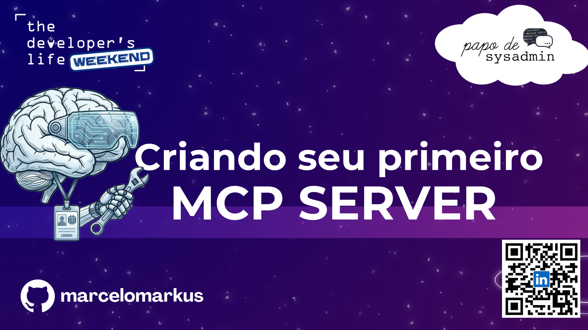

# Workshop MCP



Este projeto foi desenvolvido durante o workshop do evento [The Developers Life
Weekend](https://weekend.developerslife.tech/sobre), em Umuarama - PR.

## Sobre o workshop

Repositório com o passo a passo, código-fonte e exercícios para construir seu
primeiro servidor baseado no **Model Context Protocol (MCP)**.

Durante o workshop, foram apresentados:

- A arquitetura cliente-servidor do protocolo MCP;
- A criação e exposição de ferramentas (*tools*) para LLMs;
- O gerenciamento de recursos (*resources*) e prompts dinâmicos;
- A conexão do servidor a clientes reais de IA.

O projeto principal foi criado com Python e FastMCP. Ele disponibiliza
ferramentas e recursos para consultar a previsão do tempo e demonstra uma
operação que pede confirmação antes de enviar convites.

## Requisitos

- Python 3.14 ou superior;
- [uv](https://docs.astral.sh/uv/getting-started/installation/) instalado;
- Uma aplicação configurada no [Auth0](https://auth0.com/);
- Acesso à internet para consultar `https://wttr.in`;
- Um cliente MCP compatível, como OpenCode ou MCP Inspector.

O projeto usa `uv.lock` para manter as versões das dependências reproduzíveis.

## Instalação

Clone o repositório e entre na pasta do projeto:

```bash
git clone https://github.com/marcelomarkus/tdlw-workshop-mcp.git
cd tdlw-workshop-mcp
```

Sincronize as dependências. O comando cria ou atualiza o ambiente virtual
`.venv` automaticamente:

```bash
uv sync
```

Confira a versão do Python selecionada:

```bash
python --version
uv python find
```

## Configuração do Auth0

O servidor principal usa `Auth0Provider` e precisa destas variáveis de ambiente:

| Variável | Descrição |
| --- | --- |
| `AUTH_DOMAIN` | Domínio da instância Auth0 |
| `CLIENT_ID` | Identificador da aplicação |
| `CLIENT_SECRET` | Segredo da aplicação |
| `AUDIENCE` | Identificador da API configurada no Auth0 |

Crie o arquivo local de configuração a partir do modelo:

```bash
cp .env_example .env
```

Preencha o `.env` com valores reais:

```dotenv
AUTH_DOMAIN=https://seu-dominio.auth0.com
CLIENT_ID=seu-client-id
CLIENT_SECRET=seu-client-secret
AUDIENCE=https://sua-api
```

O arquivo `.env` não é carregado automaticamente pelo Python. Exporte as
variáveis antes de iniciar o servidor:

```bash
set -a
source .env
set +a
```

Ou defina-as diretamente na mesma chamada:

```bash
AUTH_DOMAIN="https://seu-dominio.auth0.com" \
CLIENT_ID="seu-client-id" \
CLIENT_SECRET="seu-client-secret" \
AUDIENCE="https://sua-api" \
uv run main.py
```

Nunca compartilhe o `CLIENT_SECRET` nem o inclua em commits.

## Executando o servidor

Com as variáveis carregadas, inicie o servidor principal:

```bash
uv run main.py
```

O endpoint MCP fica disponível em:

```text
http://127.0.0.1:8000/mcp
```

Mantenha o processo em execução enquanto o cliente MCP estiver conectado. Para
encerrá-lo, pressione `Ctrl+C`.

## Executando o MCP Inspector

O [MCP Inspector](https://github.com/modelcontextprotocol/inspector) fornece
uma interface web para testar tools, resources e prompts.

Em um primeiro terminal, inicie o servidor:

```bash
set -a
source .env
set +a
uv run main.py
```

Em outro terminal, execute o Inspector:

```bash
npx @modelcontextprotocol/inspector
```

Abra `http://localhost:6274` no navegador e configure:

| Campo | Valor |
| --- | --- |
| Transport | `Streamable HTTP` |
| URL | `http://127.0.0.1:8000/mcp` |

Clique em **Connect** e teste as ferramentas e os recursos disponíveis. As
variáveis do Auth0 precisam estar no ambiente do processo do servidor.

## Conectando pelo OpenCode

O arquivo `opencode.json` já aponta para o endpoint local:

```json
{
  "mcp": {
    "Workshop": {
      "type": "remote",
      "url": "http://127.0.0.1:8000/mcp"
    }
  }
}
```

Com o servidor rodando, abra o OpenCode neste projeto.

## Funcionalidades disponíveis

### Tools

- `Tempo(cidade)`: consulta o tempo atual de uma cidade;
- `Temperatura(cidade)`: consulta a temperatura atual de uma cidade;
- `Enviar_Convites(quantidade)`: solicita confirmação e simula o envio,
  reportando o progresso de cada item.

As consultas meteorológicas usam `wttr.in/<cidade>?format=%t`.

### Resources

- `workshop://oque-o-mcp-nao-e`: texto introdutório sobre MCP;
- `previsao://{cidade}`: previsão de uma cidade informada na URI.

### Prompt

- `exemplo_prompt(pergunta)`: orienta a escolha entre as tools meteorológicas.

## Estrutura do projeto

```text
.
├── main.py          # Servidor MCP principal
├── mcp_com_api.py   # Servidor MCP gerado a partir da API Petstore
├── exercises/       # Exercícios progressivos do workshop
│   ├── 01-mcp-server/
│   ├── 02-resources/
│   ├── 03-tools/
│   ├── 04-prompts/
│   ├── 05-Context/
│   ├── 06-auth/
│   └── 07-mcp-api/
├── slide/            # Material de apoio
│   └── TDLW-Umuarama.pdf
├── opencode.json    # Configuração do OpenCode
├── pyproject.toml   # Metadados e dependências
├── uv.lock          # Versões resolvidas
└── .env_example     # Modelo das variáveis do Auth0
```

## Desenvolvimento

Você pode executar o projeto pelo modo Debug do VS Code ou pelo `uv`:

```bash
uv run main.py
```

Para verificar a sintaxe dos módulos:

```bash
python -m compileall main.py mcp_com_api.py exercises
```

## Solução de problemas

### `ModuleNotFoundError`

Execute `uv sync` e rode o programa com `uv run main.py`, evitando o Python
global quando as dependências estiverem instaladas apenas em `.venv`.

### Erros de autenticação

Verifique se as quatro variáveis do Auth0 foram exportadas no mesmo ambiente do
servidor e se o domínio inclui o protocolo esperado.

### Falha na consulta meteorológica

Teste a conectividade com:

```bash
curl "https://wttr.in/Sao%20Paulo?format=%t"
```

### Porta 8000 ocupada

Libere a porta ou ajuste a porta no servidor e no `opencode.json`, mantendo o
mesmo endereço nos dois lados.

## Documentação e referências

- [Documentação oficial do uv](https://docs.astral.sh/uv/)
- [Documentação oficial do HTTPX](https://www.python-httpx.org/)
- [Documentação oficial do FastMCP](https://gofastmcp.com/)
- [Repositório oficial do MCP SDK para Python](https://github.com/modelcontextprotocol/python-sdk)
- [Documentação oficial do MCP](https://modelcontextprotocol.io/docs)
- [Especificação do protocolo MCP](https://modelcontextprotocol.io/specification/latest)
